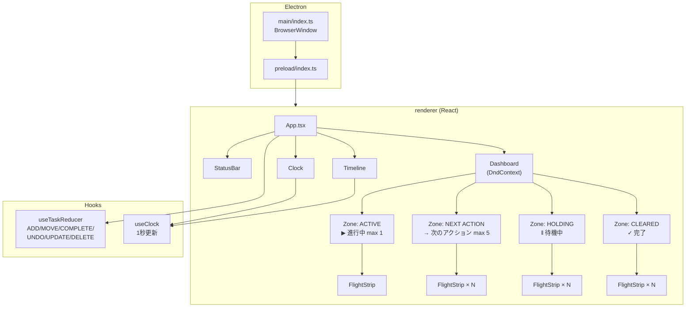

# F1: ATC型ダッシュボード — 実装完了レポート

> **実装日**: 2026-04-16  
> **ステータス**: ✅ Phase 1 完了  
> **テスト結果**: 57テスト / 11ファイル — 全パス

---

## 1. 実装サマリー

Phase 1「ATC型ダッシュボード（MVP Core）」として、F1.1〜F1.6 の全6要件を実装しました。要件の「見て、触れて、動く」最小限のアプリを確立し、ATC UIの世界観を定着させています。

### 要件充足マトリクス

| ID | 要件 | 優先度 | ステータス | 実装箇所 |
|----|------|--------|-----------|---------|
| F1.1 | 4ゾーン表示 | 必須 | ✅ 完了 | `Dashboard.tsx`, `Zone.tsx` |
| F1.2 | フライトストリップカード | 必須 | ✅ 完了 | `FlightStrip.tsx` |
| F1.3 | ドラッグ＆ドロップ | 必須 | ✅ 完了 | `Dashboard.tsx`, `Zone.tsx` (@dnd-kit) |
| F1.4 | タイムライン表示 | 必須 | ✅ 完了 | `Timeline.tsx` |
| F1.5 | ステータスバー | 必須 | ✅ 完了 | `StatusBar.tsx` |
| F1.6 | リアルタイム時計 | 必須 | ✅ 完了 | `Clock.tsx`, `useClock.ts` |

---

## 2. アーキテクチャ



---

## 3. 実装した主要コンポーネント

### データ層

| ファイル | 行数 | 役割 |
|---------|------|------|
| `types/task.ts` | 62 | `Task`, `ZoneType`, `Priority` 型定義。`ZONE_LIMITS`（ACTIVE:1, NEXT:5）。`isZoneFull()` ユーティリティ |
| `utils/flightId.ts` | 18 | `FS` + 4桁数字のフライトID生成。既存ID衝突回避 |
| `hooks/useTaskReducer.ts` | 145 | 6アクション対応の Reducer。ゾーン上限自動チェック |
| `hooks/useClock.ts` | 26 | 1秒ごと更新のリアルタイム時計フック |

### UI層

| コンポーネント | TSX行数 | CSS行数 | 備考 |
|---------------|--------|---------|------|
| `Clock` | 12 | 17 | 緑グローのデジタル時計。JetBrains Mono |
| `StatusBar` | 50 | 86 | `◆ FLIGHT STRIP TODO` + ACT:N / NXT:N / HLD:N / CLR:N · URG:N |
| `Timeline` | 104 | 136 | 6:00–24:00、スイープライン、タスクブロック。`◆ TIMELINE` ヘッダー |
| `FlightStrip` | 75 | 208 | 2行構成カード。上段=ID+時刻+バッジ、下段=タイトル+カテゴリ+DONE/UNDO |
| `Zone` | 100 | 114 | Droppable + SortableContext。アイコン・サブラベル・max 表示 |
| `Dashboard` | 134 | 47 | 3列レイアウト。DndContext + DragOverlay |
| `App` | 127 | 30 | 全コンポーネント統合。デモタスク7件 |

### デザインシステム

| ファイル | 行数 | 内容 |
|---------|------|------|
| `styles/global.css` | 141 | 50+ CSS変数のATCダークテーマ。スキャンラインオーバーレイ。スクロールバー |
| `styles/fonts.css` | 5 | JetBrains Mono + Inter (Google Fonts) |

### コード量合計

| カテゴリ | 行数 |
|---------|------|
| プロダクションコード (src/renderer) | **1,647** |
| テストコード (tests) | **612** |
| **合計** | **2,259** |

---

## 4. テスト結果

```
 ✓ tests/smoke.test.ts            (1 test)   — 疎通確認
 ✓ tests/types/task.test.ts       (8 tests)  — 型定義・ゾーン上限
 ✓ tests/utils/flightId.test.ts   (3 tests)  — ID生成・衝突回避
 ✓ tests/hooks/useTaskReducer.test.ts (9 tests) — 全アクション・上限制御
 ✓ tests/hooks/useClock.test.ts   (3 tests)  — フォーマット・1秒更新
 ✓ tests/components/Clock.test.tsx     (2 tests)  — 表示・アクセシビリティ
 ✓ tests/components/StatusBar.test.tsx (5 tests)  — ゾーン数・URG・アプリ名
 ✓ tests/components/FlightStrip.test.tsx (9 tests) — ID・タイトル・バッジ・DONE・UNDO
 ✓ tests/components/Zone.test.tsx      (8 tests)  — タイトル・アイコン・上限・空状態
 ✓ tests/components/Dashboard.test.tsx (3 tests)  — 4ゾーン描画
 ✓ tests/components/Timeline.test.tsx  (6 tests)  — マーカー・スイープライン・ブロック

 Test Files  11 passed (11)
 Tests       57 passed (57)
```

---

## 5. 設計原則への適合性

| 原則 | F1での適合 |
|------|----------|
| ① タスク総量の制限 | `ZONE_LIMITS` で ACTIVE=1, NEXT=5 を強制。Reducer がゾーン超過の MOVE を拒否する |
| ② CLEARED の離陸 | CLEARED ゾーンは右列に配置し、opacity 0.65 で視覚的に後退。UNDO でリカバリ可能 |
| ⑤ 1画面完結 | 全操作（D&D、完了、UNDO、ステータス確認、時計、タイムライン）が画面遷移ゼロで完結 |
| ⑥ 時間を「感じる」 | スイープラインが 1 秒ごとに移動。大きなデジタル時計が常時表示。緑グローで「パルス」を表現 |

> 原則③④⑦ は Phase 3-4（AI 統合）で充足する。

---

## 6. 外観比較

参照見本 (`tests/screen-shot/IMG_3720.JPG`) との比較修正を実施済み:

| 修正項目 | 詳細 |
|---------|------|
| レイアウト | 2×2 → 3列（左=ACTIVE+NEXT縦積み、中=HOLDING、右=CLEARED） |
| ゾーンヘッダー | アイコン（▶/→/‖/✓）+ 日本語サブラベル + max表示 追加 |
| フライトストリップ | 2行構成（上段=ID+時刻+バッジ、下段=タイトル大+カテゴリ+DONE） |
| ACTIVEカード | 赤グロー → 緑グラデーション |
| CLEAREDカード | ↩ UNDO ボタン追加 |
| アプリ名 | ◆ FLIGHT STRIP TODO 追加 |
| タイムライン時刻 | `06` → `06:00` フル表示 + ◆ TIMELINE ヘッダー |

---

## 7. コミット履歴

| # | ハッシュ | メッセージ |
|---|---------|----------|
| 1 | `4417ddc` | `chore: scaffold Electron + Vite + React + TypeScript project with test setup` |
| 2 | `664e5f1` | `feat: add ATC design system, Task types, zone limits, and flight ID generator` |
| 3 | `2533a45` | `feat: add useTaskReducer and useClock hooks with full test coverage` |
| 4 | `5b6ace8` | `feat: add Clock, StatusBar, FlightStrip components (F1.2, F1.5, F1.6)` |
| 5 | `c7f96b2` | `feat: complete F1 ATC Dashboard with all components integrated` |
| 6 | `a714a8b` | `fix: align UI with reference screenshot` |

---

## 8. 次のステップ（Phase 2）

Phase 2 では以下の機能を実装予定:

| 機能 | 要件ID | 概要 |
|------|--------|------|
| タスク手動作成（Quick Add） | F2.1 | タイトルのみで即座にタスク作成 |
| タスク編集 | F2.2 | タイトル、カテゴリ、優先度、予定時刻の編集 |
| ポモドーロタイマー | F3.1-F3.5 | ACTIVEタスク専用カウントダウン + ラップアップ通知 |
| ローカルJSON保存 | F5.1-F5.3 | 自動保存 + 起動時リストア |
| 繰り返しタスク | F2.4 | 日次/週次の定期タスク自動生成 |

---

> *本レポートは `task-hack-system-requirements.md` の F1 要件に対する実装完了報告です。  
> テストは `npm test` で再現可能。アプリは `npm run dev` で起動可能。*
